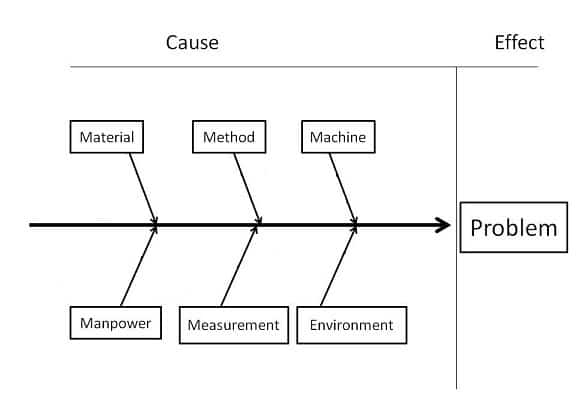

## Project Planning

In a **predictive environment** there is a significant upfront investment on planning. The plans are revisited periodically.

In an **Adaptive environment**, planning is done throughout the project. Imminent work takes priority.

## "Iron Triangle" / "Triple constraints"

### Schedule, cost, and scope

The fixed cost and schedule in **Adaptive project** are fixed. (Funnel where scope is on top). 
The flexible cost and schedule in a **predictive project** are more fluid (Pyramid, where scope is on the bottom)

## Quality in Project Management

Subjective, totality of an entity the satisfies stated or implied needs.

Various grades of products and service. Something can be low grade, but still made  or delivered with quality.

**Quality is:**
- Totality of an entity
- Satisfies needed abilities
- Stated or implied needs

**Quality processes**
- Quality planning
- Quality assurance (QA)
- Quality control (QC)

Planning is an iterative process 
PMI theme: PLAN, IMPLEMENT, MEASURE, REACT -- and document 
If the product is not acceptable, the project is not finished 
Must meet scope to achieve quality
---

### Cost of Quality

**Cost of comformance / quality to requirements**
- safety measures
- Team development and training
- Proper materials and processes

**Cost of non-comformance / poor quality to requirements**
- Liabilities
- Rework/scrap
- Lost business

**Prevention:** QA, Delivier the exact project scope and expected quality. 
**Examples** Training, safety measures, and right tools and equipment 

**Appraisal:** QC, Cost of measuring, testing, auditing, and evaluating

**Failure:** Internal failure: (Escape defect) Scrap and rework 
External failure: loss of sales, loss of customers, downtime, and damage to reputation.

### Quality management plan

- Quality standards
- Objectives
- Roles and responsibilities
- Deliverables adn processes subject to review
- Control and management activities
- Tools
- Dealing with non-conformance, corrective actions (defect/mistake repair) procedures and continuous improvement procedures

exceptions report, document costs of errors

### Quality metrics
- Percentage of tasks completed on time
- Cost performance
- Failure rate
- NUmber of defects identified per time period
- Total downtime per time period
- Errors found per unit of measure
- Customer satisfation scores

Executing process 
Sum of the plannign and implementation 
QA should occur before and during a project 
Continuous process improvement 
Managing quality is everyone's responsibility
---

### Quality Audit
- Document best practices
- Document variances
- Recommend best practices
- Implement recommendations for quality improvement
- Document quality audit in lessons learned

### Design for 'X'
- a philosophy in product design
- 'X' can mean excellence
- Specific characteristic of a solution
- Variable to be addressed
- Cost, uptime, ROI
- Consideres all componenets
- Goals include lowered costs and improve service and quality

### Results of Managing Quality
- Project management plan updates
    - Quality management plan
    - Scope baseline
    - Schedule baseline
    - Cost baseline
- Project document updates
    - Issue log
    - Lessons learned register
    - Risk register

### Controlling Quality

- monitoring and measuring project results
- Root cause analysis
- apply corrective analysis
- QC throughout the project life

Conduct statistical QC, sampling and probabilities 
Inspections audits, walkthrough, and attribute and variable sampling 
- attribute sampling: defective or not?
- Variable sampling: How defective? how far from acceptance?
- control limits
- Data gathering and analysis
- checklists, tally sheet
- Testing

QA - prevention driven
---
QC - Inspection driven
---
## Risks in Project Management

Risk is uncertain

### Qualitative risk analysis
- Prioritizing individual project risks for further analysis or action
- Assesment of probability of occurrence and impact
- Focues efforts on high-priority risks
- Fast and quick
- Not all risks need qualitative risk analysis

|Risk           |Probability|Impact  |Risk Score|
|---------------|-----------|--------|----------|
|Data Loss      |Low        |High    |Moderate  |
|Network speed  |Moderate   |Moderate|Moderate  |
|Server downtime|High       |Low     |Moderate  |
|Email down     |Low        |Low     |Low       |

identified risk           Subjective score

### Preparining for quantitative risk avalysis

ranking risk by priority - usually associated with cost

prob * impact = ex$v(Expected monetary value)

 Managing negative risks: 
Escalating, Avoiding, Transferring, Mitigating, Accepting

Managing positive risks: 
Escalating, Exploiting, Sharing, Enhancing, Accespting

### Risk Register Updates
- Response strategies
- Sepecific actions
- Triggers and warnings
- Budget, schedule
- Risks, owners, responsibilities
- Contingency plans
- Fallback plans

### Justifying risk reduction
- Addidtional time or money is typically needed
- Determine if the solution is worth tradeoffs
- Probability and impact assesment

### Cost of prevention of risk of occurance
- Cost of responding
- Cost savings if risk does not happen
- if it does, what the the project lose
- Cost inherent in project delay
- Time and cost

### Results of risk monitoring
- Work performance info
- Change requests
    - corrective actiions
    - preventive actions
- PM plan updates
- document updates
Organizational process assets updats

## Purpose of plan

- Communicates intent of project
- Serves as a guide for manager
- Provides a structure
- Provides documentation
- Provides baselines (scope, cost, sechedule, performance)

|Participant                  |Contribution                                   |
|-----------------------------|-----------------------------------------------|
|Project Manager/Scrum Master |Leadership, expertise, direction               |
|team Members                 |Knowledge of project work, schedule, etc.      |
|Customers/Porduct Owners     |Objectives, quality requirements, influence    |
|Management/Project Sponser   |Budget, resources, Methodology, quality requirements, approvals|

### Predictive project documents

- Activity attributes - Activity cost est - Duration est - Activity list
- Resource requirements - Agreements - Basics fo estimates - Change log
- Change requests 
- Forecasts (Costs, scedule )- Procurement docs - Procurement statement - Issue log
- Milestone list - Project funding requirements - Schedule - Calendar - Charter
- Statement of work - Quality checklists - Network diagrams - Staff Assignments 
- Requirements docs - Req traceability matrix - QC measuerments - Quality metrics
- Risk register - Shedule data - Resource breakdown structure - Resource calendars - Stakeholder register - Team performance assesment - Seller proposals
- Work performance reports - Work breakdown structure - Performance reports 
- Performance data

Larger project require more detail

### Predictive project documents

- Product vision
- Product roadmap
- User stories
- Release plans
- iteration plans

## Deliverables for project vs product

 Project management plan: What the project will create, deliver, operate 

-temporary effort to create a unique product, service or result
-has specific scope
-specific output

---

 Product management plan:  Managing the lifecycle, roadmap for team, alignment with organizational values

-Longer lasting, tangible or intangible object created as a result of a project
-has a much broader scope
-primary deliverable intended for use by consumer

---

### Components
- Product vision
- Target market
- Product positioning (uniqueness)
- Product roadmap
- Marketing and sales strategy
- Development
- Launch
- Budget
- Metrics (KPIs)
- Risks and issues 

### Milestone Vs. Task Duation

Milestones show progress,
loose time association (Phases) 
Tasks The work needed to reach milestones 

## Determining the number and types of resources

- Human resourses
    - people do the work
    - referred to as labor
- Physical Resources
    - Equipment, materials, harware / software
    - Facilities
    - Money

Scope is a key factor when determining needs for resources
Larger more complx projects require more resources
Risks may impact resources needed

## Steakholder Register

### Actively look for steakholders

- Identify all individuals and groups who have an interest or are affected
- Determine their level of interest or influence
- Assign classifications based on that interest or influence
- Document them in register

### Analys stakeholder requirements

- Determine the needs and expectations
- Analyse impact on each
- Prioritize those that have more influence and impact
- Document all in resgister

### Developing stakeholder engagement plan

- Identify most effective communication method
- Develope a plan for engaging and communicating throughout the project
- Assign a primary point of contact for key sh
- Document and track risks and issues

## Closure and transition

Consider projects performance first
- Reivew KPIs
- Review goals 
- Document lessons learned
- Prepare final report
- Complete and deliver all final project deliverables
- Release resources
- Document and archive materials
- Disband and release team to respective orgs

99% is not 100%

Define what it means to be done.

### Transfer Ownership

- Identify parties responsible for maintaining and using deliverables
- Coordinate transfer of ownership
- Provide training and support
- Document

### Finalizing financial and legal matters
- Review and finalize all accounts
- Settle outstanding debt or liabilities
- Close contracts or agreements (Purchase orders, etc)
- Document